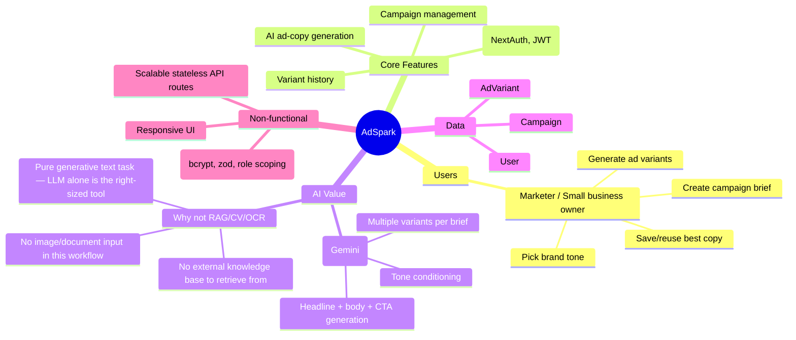
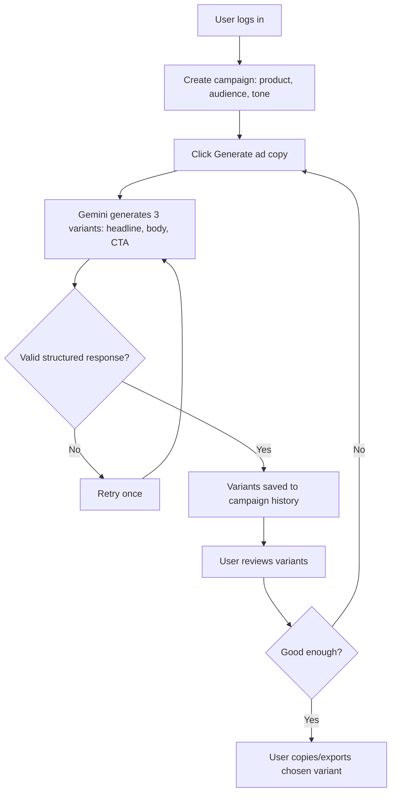

# AdSpark — Solution Mind Map

Sourced idea: **AdSpark** — AI ad-copy generator for SMBs (IdeaBrowser.com).

## Flow diagram

## AI justification (explicit, for assessment criteria)

AdSpark's core job — turning a short product brief into ready-to-use ad
copy — is a pure text-generation task. An **LLM** (Gemini) is the correctly
scoped tool:

- **RAG** was not used because there's no proprietary knowledge base the
  app needs to retrieve from; the brief itself is the only input the model
  needs.
- **Computer Vision / OCR** were not used because the workflow has no image
  or document input.
- **Predictive analytics / recommendation engines** were considered as a
  stretch feature (e.g. "which past variant performed best") but scoped out
  for the assessment timeline since there's no real performance data to
  learn from yet.
